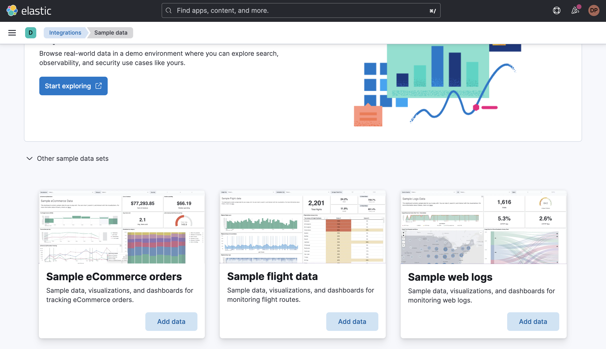

# Demo script for logstash cache elasticsearch blog post

This repository contains information which helps to create a blog post about speeding up lookup in Elasticsearch when using a Logstash pipeline.

If you want to run it, you need to create a cluster.

You can define a `.cloud` file which contains the [Elastic Cloud Key](https://cloud.elastic.co/deployment-features/keys):

```txt
EC_API_KEY=CLOUD-KEY
STACK_VERSION=8.6.1
```

Run the following command to create your cloud cluster:

```sh
./cloud-cluster.sh
```

This will print you the password. Update the `.cloud` file and add your password:

```txt
EC_API_KEY=CLOUD-KEY
STACK_VERSION=8.6.1
ELASTIC_PASSWORD=PASSWORD
```

Then you can run the `setup`:

```sh
./setup.sh
```

Once done, install the Sample web logs dataset from Kibana.



The following scripts starts the two methods for enrichment:

```sh
# Using Elasticsearch for Lookups
./logstash-es.sh
# Using a JDBC static connection to Elasticsearch (cache) for Lookups
./logstash-jdbc.sh
```
